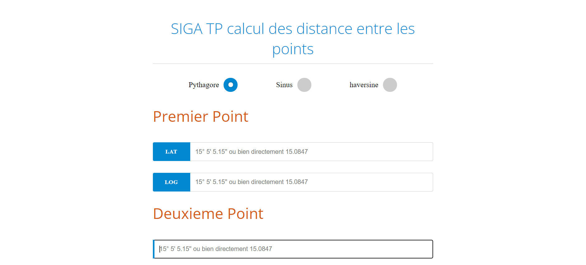

# Tp SIGA

## c'est quoi ?
 c'est une application web qui calcule la distance entre deux points quelconques sur la terre 

## comment ça marche ?

apres avoir telecharger le dosier comme la figure indique lancer le fichier index.html et faire un teste
 L'application calcule la distance avec 3 méthodes  , vous avez juste a saisir les coordonnés des deux points et choisir la methode de calcule
 
 

|telechargement|
 |:------------:|
 |

|une capture|
 |:------------:|
 |
